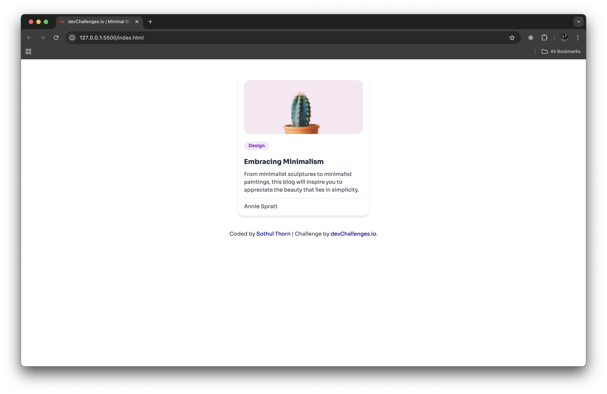

<h1 align="center">Minimal Blog Card | devChallenges</h1>

   Solution for a challenge <a href="https://devchallenges.io/challenge/minimal-blog-card" target="_blank">Minimal Blog Card</a> from <a href="http://devchallenges.io" target="_blank">devChallenges.io</a>.

  <h3>
    <a href="https://sothulthorn.github.io/devChallenges-minimal-blog-card/">
      Demo
    </a>
     | 
    <a href="https://github.com/sothulthorn/devChallenges-minimal-blog-card">
      Solution
    </a>
     | 
    <a href="https://devchallenges.io/challenge/minimal-blog-card">
      Challenge
    </a>
  </h3>

<!-- TABLE OF CONTENTS -->

## Table of Contents

- [Table of Contents](#table-of-contents)
- [Overview](#overview)
  - [What I learned](#what-i-learned)
  - [Built with](#built-with)
- [Features](#features)
- [Acknowledgements](#acknowledgements)
- [Author](#author)

<!-- OVERVIEW -->

## Overview

A simple minimal blog card.

### What I learned

- How to add and style the image
- How to use a box shadow in the css

### Built with

- Semantic HTML5 markup
- CSS

## Features

- Show a blog post card.

This application/site was created as a submission to a [DevChallenges](https://devchallenges.io/challenges-dashboard) challenge.

## Acknowledgements

- Thanks to [DevChallenges](https://devchallenges.io/challenges-dashboard) for the design brief and project idea.

## Author

- GitHub [@sothulthorn](https://github.com/sothulthorn)
